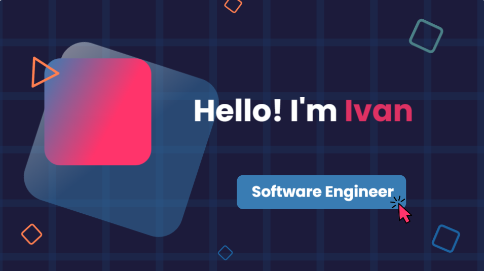

<!--<h2 align="center">
  
  
  Welcome to my profile! I'm Ivan, a computer science student passionate about building apps.
  
</h2>-->

<b> 💻 My Tech Stack</b>

| **Category** | **Technologies** |
| - | - |
**Frontend** |  
**Backend** |    
**Mobile** |  
**Cloud** |   
**Baas** |  

----      

<!--<b> 🎥 Projects</b>

- [Kotlin chat app](https://drive.google.com/file/d/1DdVZd88nOyYQDxBp-99tDO8mG1BQyKok/view?usp=sharing)
- [Kotlin hangman game](https://drive.google.com/file/d/1k26dh8VNiYoO94N1lYAh2FCODYQhw7yI/view?usp=sharing)
- [Kotlin news app](https://drive.google.com/file/d/19PKh6v9Ols6SSvrFovc5YRU8KAhrKHwG/view?usp=sharing)
- [Kotlin weather app](https://drive.google.com/file/d/12MJpzOi4MsywvKIv8P_1gMnhAPpkkfHS/view?usp=sharing)
- [Kotlin currency converter app](https://drive.google.com/file/d/1yM99chevrLA10YPjAzUoG8w6l9YkpINl/view?usp=sharing)
- [Kotlin currency converter app](https://drive.google.com/file/d/1yM99chevrLA10YPjAzUoG8w6l9YkpINl/view?usp=sharing)
- [Animated character](https://drive.google.com/file/d/1l2xLjSIoigFyg8lsq9EBYTtEfAofZ-qK/view?usp=sharing)
- [ChatZen](https://drive.google.com/file/d/1_l3SVM2eXATP8G9XMYYSPUd4O-0qySor/view?usp=sharing)
- [Java ascenseur simulate](https://drive.google.com/file/d/1o4VK2GBuUOeTWdeuymvLD8s1a4uS6Pe6/view?usp=sharing)
- [Kotlin calculator app](https://drive.google.com/file/d/114RYvT4Y3vQiu2mtL9jl0_USXuvIbZXl/view?usp=sharing)
- [Kotlin particle animation](https://drive.google.com/file/d/1uGD33rxk6NAvQMVyaG8GetPyWjg_XTQy/view?usp=sharing)
- [Kotlin sentiment analysis app](https://drive.google.com/file/d/1yiiBx43bWBLpEtr_8KvUr3Agkk5IlejZ/view?usp=sharing)
- [Kotlin splash screen animation](https://drive.google.com/file/d/1MSotPnnH3Va3IGDqKTPBWXWZ2AE7I2hW/view?usp=sharing)
- [Let's go biking](https://github.com/IvanGael/si4-lets-go-biking)
- [Java GAB simulator](https://github.com/IvanGael/Simulate-GAB)
- [Angular/spring expostions manager](https://github.com/IvanGael/angularSpring-GesExpo)
- [Resfood](https://github.com/IvanGael/Resfood)
 --> 

<b> 📊 My Stats</b>

